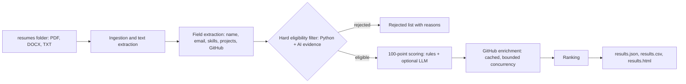

# AI Resume Screening & Ranking System

Ingests a folder of resumes (PDF required, DOCX/TXT as a bonus), applies a rule-based
Python + AI eligibility filter, scores eligible candidates on a 100 point rubric,
enriches with public GitHub activity, and writes a ranked, explainable shortlist.

## How it works



## Project layout

```
kasparro-resume-screener/
├── main.py                      CLI entry point
├── app.py                       optional FastAPI entry point (uvicorn app:app)
├── requirements.txt
├── .env.example                 all configuration, no secrets
├── pytest.ini
├── resumes/                     PUT THE COMPANY'S RESUME FOLDER CONTENTS HERE
├── sample_resumes/              synthetic demo resumes (fictional people)
├── output/
│   ├── results.json             generated for resumes/ (main deliverable)
│   ├── results.csv / .html      generated alongside (flat table / readable report)
│   └── sample_results.json      example output for sample_resumes/
├── scripts/make_sample_resumes.py
├── src/resume_screener/
│   ├── config.py                weights, thresholds, model, concurrency, env loading
│   ├── catalog.py               skill and evidence vocabulary (regex)
│   ├── models.py                Pydantic models for every stage
│   ├── ingestion.py             file discovery, PDF/DOCX/TXT reading, normalisation
│   ├── extraction.py            sections, name, email, GitHub URL, project blocks
│   ├── eligibility.py           hard filter (rule-based, no LLM)
│   ├── scoring.py               explainable 100 point model + penalties + hybrid blend
│   ├── github_enrichment.py     async GitHub client, cache, rate-limit handling, scoring
│   ├── llm.py                   provider adapter, structured output, evidence verification
│   ├── pipeline.py              orchestration with bounded concurrency
│   ├── report.py                JSON / CSV / HTML / terminal writers
│   └── api.py                   FastAPI endpoints
└── tests/                       75 tests (eligibility, scoring, GitHub, LLM, ingestion, names, pipeline, API)
```

## Setup

```bash
python -m venv .venv
source .venv/bin/activate            # Windows: .venv\Scripts\activate
pip install -r requirements.txt
cp .env.example .env                 # optional: add keys (see below). Windows: copy .env.example .env
```

Python 3.10+ is required (developed on 3.12, also tested on 3.13).

## Run

```bash
# 1. put the provided resumes in ./resumes
# 2. run the pipeline
python main.py --input ./resumes --output ./output/results.json
```

Useful flags: `--no-llm` (deterministic only), `--no-github`, `--no-cache`, `--no-extras`
(JSON only), `--top 20` (terminal rows), `--log-level INFO`.

The run prints a terminal summary and writes `results.json`, `results.csv` and `results.html`.

Try it without the real data:

```bash
python main.py --input ./sample_resumes --output ./output/demo.json --no-github
```

### API (optional)

```bash
uvicorn app:app --reload
curl -X POST localhost:8000/screen -H 'content-type: application/json' -d '{"input_dir":"resumes"}'
curl localhost:8000/results
```

`POST /screen` runs the pipeline (body optional) and returns the batch summary;
`GET /results` returns the latest full results. `input_dir` must be inside the project directory.

### Tests

```bash
python -m pytest -q
```

### Configuration (environment variables, see `.env.example`)

| Variable | Purpose |
|---|---|
| `ANTHROPIC_API_KEY` or `OPENAI_API_KEY`, `LLM_PROVIDER`, `LLM_MODEL` | enables LLM project-quality judgement. Without a key the system runs deterministically |
| `OPENAI_BASE_URL` | optional; points the `openai` provider at any OpenAI-compatible endpoint (for example Groq, see below) |
| `GITHUB_TOKEN` | optional; raises the GitHub limit from 60 to 5000 requests/hour |
| `LLM_CONCURRENCY`, `GITHUB_CONCURRENCY`, `PARSE_CONCURRENCY` | bounded concurrency |
| `LLM_BLEND` | weight of the LLM score in the AI-depth category (default 0.5) |
| `WEAK_AI_THRESHOLD`, `WEAK_AI_TOTAL_CAP` | ranking guard for profiles without a real AI project |

Weights, penalties and AI sub-weights are dataclasses in `config.py`. Vocabulary lives in `catalog.py`.

### Using a free LLM (Groq example)

The `openai` provider works with any OpenAI-compatible endpoint, so no code change is needed:

```
LLM_PROVIDER=openai
OPENAI_API_KEY=<your Groq key>
OPENAI_BASE_URL=https://api.groq.com/openai/v1
LLM_MODEL=openai/gpt-oss-20b
LLM_CONCURRENCY=1
```

## Output

`results.json` contains:

* `summary`: total files, parsed, eligible, rejected, failed/unreadable, duplicates, LLM and GitHub stats, runtime
* `ranked_candidates`: rank, `total_score`, `score_breakdown` (five categories), `penalties`, `matched_skills`,
  `project_summary`, `github_summary`, `strengths`, `concerns`, and an `evidence` block quoting the resume lines
  and per-category reasoning behind each score
* `rejected_candidates`: `candidate`, `eligible: false`, `rejection_reasons`, `matched_skills`, evidence found
* `failed_resumes`: unreadable, empty, encrypted, scanned or unsupported files with the reason
* `duplicate_resumes`: skipped copies and what they duplicate

Total score = sum of the five categories, minus penalties (max 20), floored at 0.

### Results for the provided resume set

50 resumes processed: 50 parsed, 0 failed, 0 duplicates, **37 eligible, 13 rejected**. GitHub enrichment
ran for 34 candidates with 0 failures. The submitted `results.json` was generated in **deterministic mode**
(`--no-llm`); see "LLM usage" below for why.

## Design Decisions

**Filtering strategy.** Eligibility is purely rule-based and runs before any scoring or LLM call.
Python evidence is an explicit mention anywhere, or a Python-only ecosystem (FastAPI, Django, LangGraph...)
as implicit evidence, flagged as such. AI evidence is strong when an LLM/RAG/agent framework, embeddings,
vector search, tool calling or an agentic term appears anywhere (the assignment lists frameworks as valid evidence).
Deep-learning evidence (PyTorch, TensorFlow, Hugging Face, NLP/CV) counts only when used inside a project or role,
not in a bare skills list. Classical ML alone (scikit-learn, pandas, Titanic-style projects) is rejected
with its own reason. JavaScript, Java, React or Next.js never cause rejection by themselves. Rejections carry
explicit reasons and the matched skills, as in the suggested format. The filter is deliberately conservative:
a project merely labelled "AI-powered", with no named model, framework or described retrieval/agent workflow,
is not accepted as AI evidence.

**Scoring strategy.** Fully deterministic baseline, 100 points: AI/agentic depth 40, Python and backend 30,
cloud/deployment/full stack 15, GitHub 10, engineering depth 5.
* Skills earn full credit only when used in project/experience text; a skills-list-only mention earns 40%.
* AI depth is scored per project (presence 8, orchestration 8, retrieval 8, tool use 6, evaluation 5,
  backend/data logic 3, ownership/quantified results 2). The best project counts fully, the second adds 25%.
  If AI appears only outside projects, AI points are capped at 8.
* Penalties: thin LLM wrappers (10, plus 5 if there is almost no detail, within the 5 to 15 range; 5 for a weak
  secondary project), tutorial-style or detail-free projects (5), total capped at 20.
* Ranking guard: if AI depth is below 12/40 the total is capped at 50, so strong Python alone cannot reach the top.
* Every category stores its reasoning in `evidence`, and ties break on AI depth then name.

**LLM usage.** Optional and hybrid. Hard eligibility never touches the LLM. When a key is present, the model gets
the resume (declared untrusted, to resist prompt injection inside resumes) and returns a Pydantic-validated JSON
object: AI depth 0 to 40, per-project thin-wrapper flags, verbatim evidence quotes, summary, strengths and concerns.
Quotes that do not literally occur in the resume are dropped; an LLM score that cites no verifiable evidence is ignored.
The final AI score is `LLM_BLEND` x LLM + (1 - `LLM_BLEND`) x deterministic. One repair retry on invalid output;
timeouts, provider errors and bad JSON fall back to deterministic scoring for that resume and are logged in
`warnings`. Provider code is isolated in `_complete` of `AnthropicClient` / `OpenAIClient`.

*What was submitted.* The submitted `results.json` was generated in deterministic mode. I verified the LLM path
end-to-end on the sample resumes using a free Groq model (`openai/gpt-oss-20b`, 0 failures). On the full
50-resume run, the free tier's rate limits made 29 of 37 calls fall back to deterministic scoring, which is the
designed behaviour but gives a mixed ranking, so I submitted consistent rule-based scores for every candidate.
Setting a key with higher limits enables the hybrid scoring with no code change.

**GitHub scoring.** The username comes from the resume text and from PDF hyperlink annotations (anchor text often
just says "GitHub"). Profile links are preferred over repo links; reserved paths are ignored. Score (max 10) =
activity 0 to 5 (public events in the last 90 days tier + recency tier) + repositories 0 to 5 (maintained non-fork,
non-archived repos pushed within a year + Python/AI-relevant repos). Only eligible candidates are enriched to save
API quota (2 calls per user). Results are cached per run (concurrent lookups share one fetch) and on disk with a TTL.
A missing profile, 404, rate limit, timeout or 5xx never fails screening: the status is recorded
(`not_provided`, `not_found`, `rate_limited`, `error`, `partial`) and the candidate scores 0 for that category.
After a rate limit the remaining lookups short-circuit instead of retrying. Tokens come from `GITHUB_TOKEN` only.

**Reliability.** Each resume is processed in isolation: corrupt, empty, encrypted, image-only and unsupported files
are reported in `failed_resumes`; identical files and same-email resumes are de-duplicated; per-resume LLM and scoring
errors are contained. Parsing, LLM and GitHub work run with bounded concurrency (semaphores).

## If I Had More Time

1. Run the LLM judge on the full set with a higher-limit key, and compare its ranking against the rule-based one
   to measure where the two disagree.
2. Add OCR (for scanned PDFs) and layout-aware parsing for two-column resumes, which currently can interleave text,
   and make name extraction robust to headers where the name is split across lines or glued to the email.
3. Add a "borderline" flag for resumes that claim an AI project without naming a model or framework, so a human can
   review them, and build a labelled set to calibrate weights (for example with NDCG) instead of tuning by inspection.
4. Deepen GitHub signals (commit counts via GraphQL, README/test presence) and retry GitHub calls without the token
   when it is rejected with a 401, instead of failing the lookup.

## Known limitations

* Project boundaries are detected heuristically; a resume with unusual formatting may merge projects.
* Keyword vocabulary will miss unlisted frameworks; extend `catalog.py`.
* Name extraction uses header heuristics with an email and filename fallback, so an unusual header can yield a
  name derived from the email.
* The deterministic mode cannot judge writing quality or truthfulness; the LLM mode is advisory and verified only
  by quote matching.
